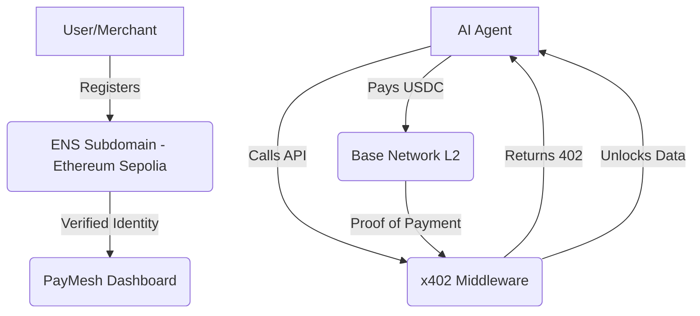

# ⚡ PayMesh: The x402 Infrastructure for Autonomous Finance

PayMesh is a high-performance, cross-chain payment layer designed to bridge the gap between traditional API services and the emerging economy of **AI Agents**. By implementing the **HTTP 402 (Payment Required)** standard, PayMesh allows developers to monetize any infrastructure with instant, on-chain settlements.


---

## 🚀 The Vision: Stripe for AI Agents

Most traditional payment systems (Stripe, PayPal) are built for humans—they require UIs, credit cards, and recurring subscriptions. **PayMesh is built for Machine-to-Machine (M2M) commerce.**

- **The Problem**: AI Agents often fail when they hit credit card paywalls or complex subscription requirements.
- **The Solution**: PayMesh provides a protocol-level payment response (x402). If an agent calls a protected API, they receive a machine-readable 402 status. The agent then sends a fractional USDC payment on Base and retries the call with an `X-Payment` proof-of-payment header to immediately unlock the resource.

---

## ✨ Key Features

### 🆔 Cross-Chain Identity (PayMesh ID)
Users can register a unique, human-readable **PayMesh ID** (e.g., `alice.paymesh.eth`) via our custom ENS subdomain registrar on **Ethereum Sepolia**. This ID acts as your global merchant identity across the ecosystem.

### 💸 High-Velocity Payments
Settlements occur on the **Base Network (L2)** using native USDC. This ensures:
- **Near-Zero Fees**: Micro-payments (e.g., $0.001) are economically viable.
- **Sub-2 Second Finality**: APIs unlock almost instantly after payment.
- **Stable Pricing**: Developers earn in USDC, avoiding crypto volatility.

### 🛡 x402 Middleware
Integrate monetization with **one line of code**. Our Next.js-compatible middleware handles:
- Cryptographic transaction verification.
- Real-time price validation.
- Automatic 402 status generation.

### 📊 Provider Dashboard
A premium, real-time analytics dashboard to track:
- Total revenue and API call volume.
- Active "PayMesh ID" status.
- Recent transaction history and settlement logs.

### 🌐 Agent-Discovery Marketplace
A programmatic marketplace (`/api/marketplace`) where AI Agents can autonomously discover API providers based on category, price, and reliability.

---

## 🏗 Architecture

PayMesh leverages a hybrid cross-chain architecture to provide the best user experience and lowest costs.



---

## 🛠 Tech Stack

- **Framework**: [Next.js 15](https://nextjs.org/) (Turbopack)
- **Styling**: [Tailwind CSS 4](https://tailwindcss.com/) & [Framer Motion](https://www.framer.com/motion/)
- **Blockchain Interface**: [Viem](https://viem.sh/) & [Wagmi 2.0](https://wagmi.sh/)
- **Onchain Components**: [Coinbase OnchainKit](https://onchainkit.xyz/)
- **Streaming**: [Superfluid](https://www.superfluid.finance/) (for high-frequency streams)
- **Backend/DB**: [Supabase](https://supabase.com/)
- **Identity**: [ENS (Ethereum Name Service)](https://ens.domains/)

---

## 🚥 Getting Started

### Prerequisites
- Node.js 20+
- A wallet with Sepolia ETH (for ENS registration) and Base Sepolia USDC (for payments).

### 1. Clone & Install
```bash
git clone https://github.com/dhruvxop19/paymesh.git
cd paymesh/paymesh
npm install
```

### 2. Environment Setup
Create a `.env.local` file in the root directory:

```env
# Network Config
NEXT_PUBLIC_BASE_SEPOLIA_RPC=...
NEXT_PUBLIC_CHAIN_ID=84532
NEXT_PUBLIC_USDC_ADDRESS=...

# Identity (ENS)
PAYMESH_SUBDOMAIN_CONTRACT=0xf7f47FE64c7cbc99deDD53F31e1E9E189e1ee3BE
ETHEREUM_SEPOLIA_RPC=...
ADMIN_PRIVATE_KEY=...

# Backend
SUPABASE_URL=...
SUPABASE_ANON_KEY=...
```

### 3. Run Locally
```bash
npm run dev
```

---

## 💻 Developer Guide: Monetizing an API

Protect any Next.js route handler by wrapping it with our `paymeshNext` utility.

```typescript
import { paymeshNext } from 'paymesh-x402'

export async function GET(request: Request) {
  // 1. Validate payment against the Base network
  const paymentCheck = await paymeshNext(request, {
    price: '0.005',           // Cost in USDC
    payTo: '0xYourMerchantWallet'
  });
  
  // 2. If unpaid, automatically returns Response with 402 status
  if (paymentCheck) return paymentCheck; 
  
  // 3. Logic only executes if payment is cryptographically verified
  return Response.json({
    message: "Authorized access to premium AI resource.",
    data: { ... }
  });
}
```

---

## 🛡 Security & Verification

Every payment submitted via the `X-Payment` header is validated through three stages:
1.  **Semantic Check**: Validates the transaction format and chain ID.
2.  **On-Chain Verification**: Queries the Base network to ensure the transaction exists and is finalized.
3.  **Attribute Matching**: Confirms the amount, recipient, and token address (USDC) match the provider's requirements.

---

## 📄 API Reference

| Endpoint | Method | Description |
| :--- | :--- | :--- |
| `/api/register` | `POST` | Register a new API provider service. |
| `/api/subdomain/check` | `GET` | Verify availability of a PayMesh ID label. |
| `/api/subdomain/register`| `POST` | Claim an ENS subdomain (PayMesh ID). |
| `/api/marketplace/discover`| `GET` | Fetch available machine-payable endpoints. |

---

## 🤝 Contributing

We welcome contributions from the community! Whether it's fixing bugs, improving documentation, or proposing new features for the x402 protocol, please open an issue or PR.

Built with ❤️ for the future of **Autonomous Agent Commerce** on **Base**.

